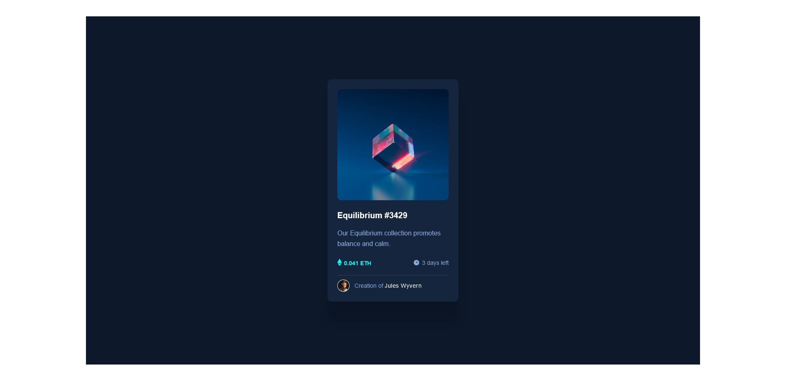

# Frontend Mentor - NFT preview card component solution

This is a solution to the [NFT preview card component challenge on Frontend Mentor](https://www.frontendmentor.io/challenges/nft-preview-card-component-SbdUL_w0U). Frontend Mentor challenges help you improve your coding skills by building realistic projects. 

## Table of contents

- [Overview](#overview)
  - [The challenge](#the-challenge)
  - [Screenshot](#screenshot)
  - [Links](#links)
- [My process](#my-process)
  - [Built with](#built-with)
  - [What I learned](#what-i-learned)
  - [Continued development](#continued-development)
  - [Useful resources](#useful-resources)
- [Author](#author)
- [Acknowledgments](#acknowledgments)

## Overview

### The challenge

Users should be able to:

- View the optimal layout depending on their device's screen size
- See hover states for interactive elements

### Screenshot

### Links

- Live Site URL: https://nft-preview-card-component-solution.netlify.app/

## My process

### Built with

- Semantic HTML5 markup
- CSS custom properties
- Flexbox
- CSS Grid
- Desktop-first workflow

### What I learned

I wouldn't say i learn that much with this challenge as i have already know everything it takes to solve the challenge. But of course the challenge gave me what i needed which is practising my newly acquired skills.

### Continued development

I would love to keep working on my css skills especially css gird and flexbox and also the animation part. 

### Useful resources

- With jonas schmedtmann html and css course on udemy you will learn everything it takes to build this challenge and even more!

## Author

- Frontend Mentor - [@Abu-Sman](https://www.frontendmentor.io/profile/@Abu-Sman)
- Twitter - [@Abu_Sman01](https://www.twitter.com/@Abu_Sman01)

## Acknowledgments

Shout out to Jonas Schmedtmann!!! His HTML and CSS course from udemy was all i needed to learn html and css.
